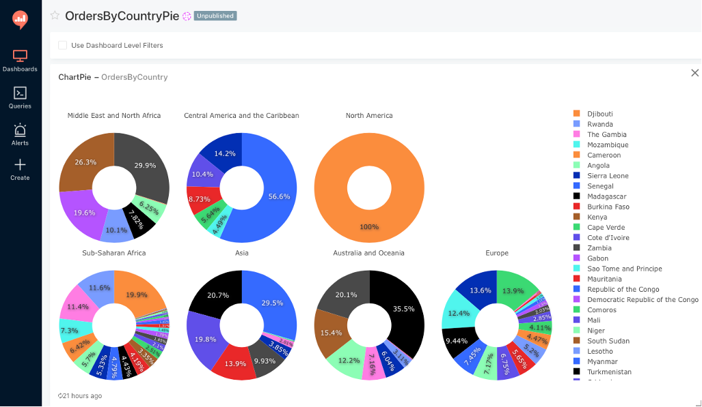

#JDBC-S3 driver
The driver is designed to query data in CSV and JSON format in S3 object stores such as AWS S3 using standard SQL queries.

The driver is a fork of the project https://github.com/amannm/lake-driver

Most of the work is done using the Apache Calcite and Avatica projects and the ProjectableFilterableTable interface.  
https://calcite.apache.org  
https://calcite.apache.org/avatica

Apache Calcite optimizes queries and push-downs the columns and filters from SQL to S3 Select query. Unlike regular columns and filters, aggregate functions are calculated on the driver side.

Compared to the Lake-driver, the JDBC-S3 driver additionally implements:

1. Push-down of all basic SQL statements to S3 select
2. Date format support in S3 Select WHERE clause
3. Processing of S3 storage data in JSON format
4. Unit tests with queries to data in CSV and JSON formats
5. Python class for driver integration with Redash BI system
6. UI client in Java Swing demonstrating driver operation
7. Code refactoring of the Lake-driver project was carried out
8. Gradle builder replaced by Maven 

##Build
The following command is used to build driver to single jar file with all dependencies:  
**mvn clean compile assembly:single**

##Usage
There are two test Java client applications in the project along with a driver for an example of its use - console client and Java Swing client.
They create a standard JDBC connection java.sql.Connection where the data model is passed in the URL in the form of json with a tables and fields specifications. 
Also attributes of connection to S3 storage are passed in the URL. 
After establishing a Connection, the standard JDBC methods can be used to query data in CSV and JSON formats as database tables. 
Table specifications in the form of json from which the data model is built are located in the **test\resources folder**. 
Each table has a location attribute - the path to the data file in S3 storage. 
These files has to be manually copied to the storage from the **client\src\main\resources\data** folder.

##Connecting the driver to Redash
Instructions for installing Redash in Docker https://redash.io/help/open-source/dev-guide/docker
Instructions for connecting JDBC drivers to Redash https://linuxtut.com/en/fe748b28431421a430d3/

To connect the JDBC driver to Redash copy the following files to the redash/query_runner folder:   
* JDBC driver **target/jdbc-s3-driver.jar** 
* Query runner for the JDBC driver **client/src/jdbc_s3.py** 
* Data model **client/src/resources/s3model.json**.   
 Change the connection parameters and paths to data files in the data model to yours

**An example of a Chart built in Redash that use a SQL query to orders.csv in S3 storage**

