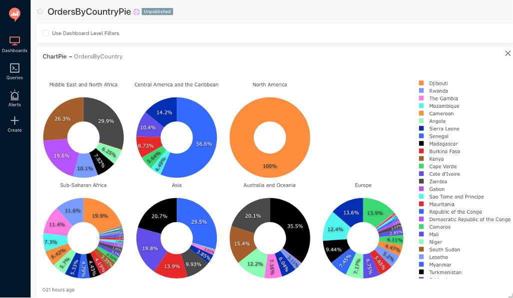

# JDBC-S3 драйвер

Драйвер предназначен для выполнения запросов к данным в формате CSV и JSON в объектных S3 хранилищах таких как AWS S3 посредством стандартных SQL запросов.

Драйвер является Fork-ом проекта https://github.com/amannm/lake-driver 

Большая часть работы делается с использованием проектов Apache Calcite и Avatica и интерфейса ProjectableFilterableTable.  
https://calcite.apache.org  
https://calcite.apache.org/avatica

Apache Calcite оптимизирует запросы и выполняет push-down используемых в запросе колонок и фильтров из SQL в S3 Select запрос.
В отличие от обычных колонок и фильтров агрегатные функции вычисляются на стороне драйвера. 

По сравнению с Lake-driver в JDBC-S3 драйвере дополнительно реализовано:
1. Push-down всех основных SQL операторов в S3 select
2. Добавлена работа с форматом даты в условии WHERE в S3 Select
3. Добавлена обработка данных S3 хранилища в JSON формате
4. Разработаны Unit тесты с запросами к данным в CSV и JSON форматах
5. Добавлен Python класс для интеграции драйвера с BI системой Redash
6. Добавлен UI клиент на Java Swing демонстрирующий работу драйвера
7. Проведен полный рефакторинг кода проекта Lake-driver
8. Сборщик Gradle заменен на Maven

## Сборка  
Для сборки драйвера со всеми зависимостями в один jar файл используется следующая команда:  
**mvn clean compile assembly:single**

## Использование

В проекте вместе с драйвером для примера его использования находятся два тестовых клиентских Java приложения - консольный клиент и  Java Swing клиент. 
В них создается стандартное JDBC подключение java.sql.Connection где в URL передается модель данных в виде json с описанием таблиц и полей. 
Также в URL передаются атрибуты подключения к S3 хранилищу.
После получения Connection можно использовать стандартные JDBC методы для запроса к данным в CSV и JSON формате как к таблицам БД.
Спецификации таблиц в виде json из которых строится модель данных находятся в папке **test\resources**.
Каждой таблице задается location - путь к файлу с данными в S3 хранилище.
Эти файлы должны быть предварительно скопированы в хранилище из папки **client\src\main\resources\data**.

## Подключение драйвера к Redash

Инструкция по установке Redash в Docker https://redash.io/help/open-source/dev-guide/docker  
Инструкция для подключения JDBC драйверов к Redash https://linuxtut.com/en/fe748b28431421a430d3/

Для подключения JDBC драйвера к Redash в папку redash/query_runner необходимо скопировать:
* JDBC драйвер **target/jdbc-s3-driver.jar**
* Query runner для JDBC драйвера **client/src/jdbc_s3.py**
* Модель данных **client/src/resources/s3model.json** заменив в ней параметры подключения и пути к файлам данных на свои

**Пример диаграммы построенной в Redash по данным файла orders.csv в S3 хранилище**

